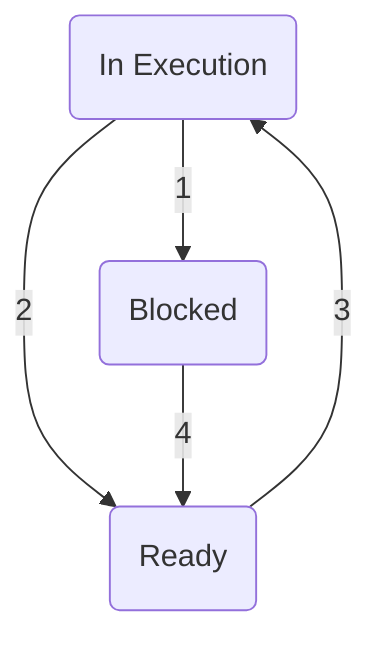

These notes are taken from Modern Operating Systems, 2nd edition by Andrew S. Tanenbaum.

<hr /> 

# Processes and Threads
<sup>Page 53 - 112 </sup>

## **2.1 - Processes**
A computer can do several things at a time. A CPU can jump from program to program several times a second, executing each for milliseconds at a time. Whilst it can only work on one task at a given moment, a processor can change between them and give an impression of parallelism (pseudoparallelism - an imitation of the parallelism done by multiprocessors that have two or more CPUs and share simultaneously the same physical memory).

**2.1.1 - The Model of a Process**

In such a model, all software executables are organized in sequential processes. A process is a program in execution, accompanied by the current value of the program counter (PC), registers and variables. The mechanism of rapid transition between processes is called **multiprogramming**.

Each process has its own control flow. When it is executed, this virtual program counter is loaded into the real program counter. When the allocated CPU time for a process ends, the physical program counter is saved into the logical program counter of the process in memory. 

A program is the code stored in memory. It's static - think of it as a recipe. The process is the execution of said program and can change states during its runtime.

**2.1.2 - Process Creation**

In general purpose operating systems, a way of creating and terminating processes during operation is necessary when needed. There are four main events that lead to the creation of a process:

1. OS initialization.
2. Execution of a system call to create a process by another process in execution.
3. A user requisition to create a new process.
4. Start of a job in (portuguese: lote?).

When the operating system is loaded, many processes are created. Some of these interactive with users and perform tasks for them. Some others run on the background, doing things such treating messages, web pages, news, etc. These are called **daemons**.

**2.1.3 - Process Termination**

After being created, a process executes its function and then it will end. Processes end because of one of the following:

1. Standard output (voluntary).
2. Error output (voluntary).
3. Fatal error (involuntary).
4. Cancelation by another process (involuntary).

In some systems, when a process is terminated, the other processes created by it are as well. However, this is not the case for both Unix and Windows.

**2.1.4 - Process Hierarchies**

In Unix, all processes, their offspring and descendents forma a group of processes. When the system is turned on, a initial process called _init_ is present in the system's load(?) image. All processes in the system belong to a single tree of which _init_ is root.

**2.1.5 - States of Processes**

Although every process is an independent entity, with its own program counter and internal state, in many cases processes need to interact with each other. For instance, a process might generate an output that another process will use as input. For instance:

```bash
cat chapter1 chapter2 chapter3 | grep tree
```

It might occur that `grep` is ready before `cat`. However, the former needs the latter's output to work. Thus, `grep` is blocked from running until the output from `cat` is ready.
There are 3 possible states to a process:

1. In execution (using the CPU in that instant).
2. Ready (executable; temporarily stopped so that another process can run).
3. Blocked (incapable of executing until an external event doesn't occur).



1. The process gets blocked awaiting an input.
2. Process manager selects another process.
3. Process manager selects this process.
4. The input becomes available.

**2.1.6 - Process Implementation**


